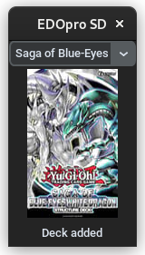

# EDOpro Structure Decks

## Download for [Windows](https://fabianjuelich.xyz/EDOpro-SD/EDOpro%20SD.exe)

## Note:
- If you did not install the game in the default path, please edit the configuration file that is created at startup
- The underlying data does not indicate the quantity of a card in the deck, so please add affected ones manually

### Credits and License
Yu-Gi-Oh! is a trademark of Shueisha and Konami. This project is not affiliated with or endorsed by Shueisha or Konami. \
<a target="_blank" href="https://icons8.com/icon/pMCn7wnYUJWq/card-game">Card Game</a> icon by <a target="_blank" href="https://icons8.com">Icons8</a>